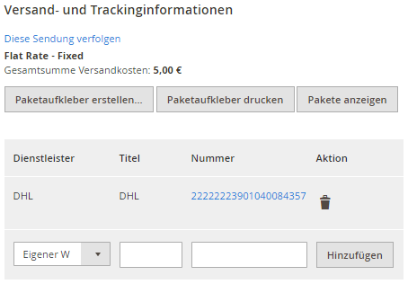

.. |date| date:: %d/%m/%Y
.. |year| date:: %Y

.. footer::
   .. class:: footertable

   +-------------------------+-------------------------+
   | Stand: |date|           | .. class:: rightalign   |
   |                         |                         |
   |                         | ###Page###/###Total###  |
   +-------------------------+-------------------------+

.. header::
   .. image:: images/dhl.jpg
      :width: 4.5cm
      :height: 1.2cm
      :align: right

.. sectnum::

=================================================================
DHL Versenden (Shipping) M2: Paketversand für DHL Geschäftskunden
=================================================================

Das Modul *DHL Versenden (Shipping)* für Magento® 2 ermöglicht es Händlern mit einem
DHL-Konto Sendungsaufträge anzulegen und DHL-Versandscheine (Paketaufkleber) abzurufen.

Es werden die Schnittstellen *DHL Geschäftskundenversand API (Business Customer Shipping)*
und *eCommerce Global Label API* unterstützt. Die tatsächlich nutzbaren Schnittstellen
hängen vom Absenderstandort ab.

.. raw:: pdf

   PageBreak

.. contents:: Endbenutzer-Dokumentation

   
Voraussetzungen
===============

Die nachfolgenden Voraussetzungen müssen für den reibungslosen Betrieb des Moduls erfüllt sein.

Magento® 2
----------

Folgende Magento® 2-Versionen werden vom Modul unterstützt:

- Community Edition 2.1.4 oder höher

PHP
---

Folgende PHP-Versionen werden vom Modul unterstützt:

- PHP 5.6.5+
- PHP 7.0.6+

Weitere Informationen finden Sie auch in den Dateien *README.md* und *composer.json* im
Modulpackage. Im Zweifelsfall sind die Versionsangaben in der Datei *composer.json* maßgeblich.

Siehe auch https://github.com/netresearch/dhl-module-shipping-m2/tree/0.2.0

Für die Anbindung des DHL Webservice muss die PHP SOAP Erweiterung auf dem
Webserver installiert und aktiviert sein.

Hinweise zur Verwendung des Moduls
==================================

Versandursprung und Währung
---------------------------

Bei Nutzung der *DHL Geschäftskundenversand API (Business Customer Shipping)* ist der
Versand aus Deutschland und Österreich möglich. Die Absenderadresse des Shops muss in
einem dieser Länder liegen.

Wenn die *eCommerce Global Label API* genutzt wird, ist der Versand von bzw. in folgende
Länder möglich: USA, China (einschl. Hongkong), Singapur, Thailand, Malaysia. Beachten Sie
auch die Informationen in Abschnitt `Internationale Sendungen`_ weiter unten.

Stellen Sie in jedem Fall sicher, dass die Absenderadressen in den drei im Abschnitt
Modulkonfiguration_ genannten Bereichen korrekt ist.

Als Basiswährung wird die für das jeweilige Absenderland offiziell gültige Standardwährung
angenommen, die in der Magento-Konfiguration eingestellt sein muss. Es findet keine
automatische Konvertierung der Währungen statt.

   
Installation und Konfiguration
==============================

Im Folgenden wird beschrieben, wie das Modul installiert wird und welche
Konfigurationseinstellungen vorgenommen werden müssen.

Installation
------------

Installieren Sie das Modul gemäß der Anweisung in der Datei *README.md*, die Sie im
Modulpackage finden. Achten Sie darauf, alle Anweisungen exakt zu befolgen und keine
Schritte zu überspringen.

In der Datei *README.md* finden Sie zudem Informationen, welche Änderungen in der
Datenbank durch die Installation vorgenommen werden.

Die Datei *README.md* ist im Abschnitt `Voraussetzungen`_ verlinkt.

Modulkonfiguration
------------------

Für die Abwicklung von Versandaufträgen sind drei Konfigurationsbereiche relevant:

::

    Stores → Konfiguration → Allgemein → Allgemein → Store-Information
    Stores → Konfiguration → Verkäufe → Versandeinstellungen → Herkunft
    Stores → Konfiguration → Verkäufe → Versandarten → DHL Versenden

Stellen Sie sicher, dass die erforderlichen Felder aus den Bereichen
*Store-Information* und *Herkunft* vollständig ausgefüllt sind:

* Store-Information

  * Store-Name
  * Store-Kontakttelefon
* Herkunft

  * Land
  * Region/Bundesland
  * Postleitzahl
  * Stadt
  * Straße

Wenn Sie aus mehreren Ländern versenden, können Sie auf Store- bzw. StoreView-Ebene
abweichende Absenderadressen eintragen.

.. admonition:: Hinweis

   Der Abschnitt *Versandarten → DHL* ist Kernbestandteil von Magento® 2 und bindet
   die Schnittstelle von DHL USA an. Diese Einstellungen beziehen sich nicht auf die
   *DHL Versenden (Shipping)*-Extension.

.. raw:: pdf

   PageBreak

Allgemeine Einstellungen
~~~~~~~~~~~~~~~~~~~~~~~~

Im Konfigurationsbereich *Allgemeine Einstellungen* wird festgelegt, welche API-Anbindung
genutzt werden soll. Die Einstellung hängt von Ihrem DHL-Konto bzw. Vertrag ab. Wählen Sie
zwischen:

* DHL Business Customer Shipping (Geschäftskundenversand), oder
* DHL eCommerce Global Label API

Außerdem kann in diesem Abschnitt gewählt werden, ob der *Sandbox-Modus* zum Testen
der Integration verwendet oder die Extension produktiv betrieben werden soll.

Wenn die Protokollierung aktiviert ist, werden Webservice-Nachrichten in die Magento® 2
Log-Dateien in ``var/log`` geschrieben. Es wird *keine gesonderte* Log-Datei für
die DHL-Extension erstellt.

Sie haben die Auswahl zwischen drei Protokollstufen:

* ``Error`` zeichnet Kommunikationsfehler zwischen Shop und DHL Webservice auf,
* ``Warning`` zeichnet Kommunikationsfehler sowie Fehler, die auf den Inhalt der
  Nachrichten zurückgehen (z.B. Adressvalidierung, ungültige Service-Auswahl), auf und
* ``Debug`` zeichnet sämtliche Nachrichten auf, einschl. heruntergeladener Paketaufkleber.

.. admonition:: Hinweis

   Stellen Sie sicher, dass die Log-Dateien regelmäßig bereinigt bzw. rotiert werden. Die
   Einstellung *Debug* sollte nur zur Problembehebung aktiviert werden, da die Log-Dateien
   sehr umfangreich werden können.

Weitere Eingabefelder, die hier nicht beschrieben wurden, sind nicht relevant.

Stammdaten
~~~~~~~~~~

Im nächsten Konfigurationsbereich werden Ihre Zugangsdaten für den DHL Webservice
hinterlegt, die für den Produktivmodus erforderlich sind. Die Zugangsdaten erhalten Sie
direkt von DHL.

Die Eingabefelder erscheinen nur, wenn der Sandbox-Modus abgeschaltet wird.

Für die Nutzung des *DHL Geschäftskundenversands (Business Customer Shipping)* tragen Sie
folgende Daten ein:

* Benutzername (User)
* Passwort (Signature)
* EKP (DHL-Kundennummer, 10 stellig)
* Teilnahmenummern (Participation, jeweils zweistellig)

Zur Nutzung der *eCommerce Global Label API* sind die o.g. Angaben nicht notwendig. Tragen
Sie stattdessen die folgenden Daten ein, die Sie von DHL erhalten:

* Pickup Account Number (5-10 stellig)
* Distribution Center (6 stellig)
* Client ID
* Client Secret

.. raw:: pdf

   PageBreak

Versandaufträge
~~~~~~~~~~~~~~~

Im Konfigurationsbereich *Versandaufträge* werden Einstellungen vorgenommen, die
für die Erteilung von Versandaufträgen über den DHL Webservice erforderlich sind.

* *Nur leitkodierbare Versandaufträge erteilen*: Ist diese Einstellung aktiviert,
  wird DHL nur Sendungen akzeptieren, deren Adressen absolut korrekt sind. Ansonsten 
  lehnt DHL die Sendung mit einer Fehlermeldung ab. Wenn diese Einstellung abgeschaltet 
  ist, wird DHL versuchen, fehlerhafte Lieferadressen automatisch korrekt zuzuordnen, 
  wofür ein Nachkodierungsentgelt erhoben wird. Wenn die Adresse überhaupt nicht 
  zugeordnet werden kann, wird die Sendung dennoch abgelehnt.
* *Versandarten für DHL Versenden*: Legen Sie fest, welche Versandarten für die
  Versandkostenberechnung im Checkout verwendet werden sollen. Nur die hier ausgewählten
  Versandarten werden bei der Lieferscheinerstellung über die DHL-Extension abgewickelt.
* *Standardprodukt*: Stellen Sie hier das DHL Produkt ein, das standardmäßig zur
  Erstellung von Versandaufträgen verwendet werden soll. Beachten Sie die Hinweise im
  Abschnitt Modulkonfiguration_ zur Absenderadresse.
* *Nachnahme-Zahlarten für DHL Versenden*: Legen Sie fest, bei welchen Zahlarten
  es sich um Nachnahme-Zahlarten handelt. Diese Information wird benötigt, um
  bei Bedarf den Nachnahmebetrag an den DHL Webservice zu übertragen und passende 
  Nachnahme-Label zu erzeugen. Dieser Service ist nur bei Nutzung des *DHL
  Geschäftskundenversands (Business Customer Shipping)* nutzbar.

Kontaktinformationen
~~~~~~~~~~~~~~~~~~~~

Im Konfigurationsbereich *Kontaktinformationen* legen Sie fest, welche zusätzlichen
Absenderdaten zur Erstellung von Versandaufträgen an DHL übermittelt werden sollen. Es
werden außerdem die Absenderdaten aus der allgemeinen Magento-Konfiguration verwendet.

Bei Nutzung der *eCommerce Global Label API* können hier keine zusätzlichen Angaben
eingetragen werden.

Bankverbindung
~~~~~~~~~~~~~~

Im Konfigurationsbereich *Bankverbindung* legen Sie fest, welche Bankdaten für
Nachnahme-Versandaufträge an DHL übermittelt werden. Der vom Empfänger erhobene
Nachnahmebetrag wird auf dieses Konto transferiert.

Dieser Abschnitt wird bei Nutzung der *eCommerce Global Label API* nicht angezeigt,
da hier kein Nachnahmeversand möglich ist.

eCommerce Global API Versandeinstellungen
~~~~~~~~~~~~~~~~~~~~~~~~~~~~~~~~~~~~~~~~~
Hier können Einstellungen zur Labelgröße, Seitengröße und Seitenlayout vorgenommen werden.

Dieser Abschnitt erscheint nur bei Nutzung der *eCommerce Global Label API*.

Ablaufbeschreibung und Features
===============================

Annahme einer Bestellung
------------------------

Im Folgenden wird beschrieben, wie sich die DHL-Extension in den Bestellprozess integriert.

Bestellung über Checkout
~~~~~~~~~~~~~~~~~~~~~~~~

In der Modulkonfiguration_ wurden Versandarten für die Abwicklung der Versandaufträge
und die Erstellung der Paketaufkleber eingestellt. Wählt der Kunde im Checkout-Schritt
*Versandart* eine dieser DHL-Versandarten, kann die Lieferung im Nachgang über DHL
abgewickelt werden.

Im Checkout-Schritt *Zahlungsinformation* werden Nachnahme-Zahlungen automatisch
deaktiviert, falls der Nachnahme-Service für die gewählte Lieferadresse nicht zur
Verfügung steht (siehe *Nachnahme-Zahlarten für DHL Versenden*).

Bestellung über Admin Panel
~~~~~~~~~~~~~~~~~~~~~~~~~~~

Nachnahme-Zahlarten werden ebenso wie im Checkout deaktiviert, falls der
Nachnahme-Service für die gewählte Lieferadresse nicht zur Verfügung steht.

.. raw:: pdf

   PageBreak

Erstellen eines Versandauftrags
-------------------------------

Im Folgenden Abschnitt wird beschrieben, wie zu einer Bestellung ein Versandauftrag
erstellt und ein Paketaufkleber abgerufen wird.

Nationale Sendungen
~~~~~~~~~~~~~~~~~~~

Öffnen Sie im Admin Panel eine Bestellung, deren Versandart mit dem DHL-Versand
verknüpft ist (siehe `Modulkonfiguration`_, Abschnitt *Versandarten für DHL Versenden*).
Betätigen Sie dann den Button *Versand* im oberen Bereich der Seite.

.. image:: images/de/button_ship.png
   :scale: 75 %

Es öffnet sich die Seite *Neuer Versand für Bestellung*. Wählen Sie die Checkbox
*Paketaufkleber erstellen* an und betätigen Sie den Button *Lieferschein erstellen…*.

.. image:: images/de/button_submit_shipment.png
   :scale: 75 %

Es öffnet sich nun ein Popup zur Definition der im Paket enthaltenen Artikel. Das im
Abschnitt `Versandaufträge`_ eingestellte Standardprodukt ist hier vorausgewählt.
Betätigen Sie den Button *Artikel hinzufügen*, markieren Sie die bestellten
Produkte und bestätigen Sie Ihre Auswahl durch Klick auf
*Gewählte Artikel zum Paket hinzufügen*. Die Angabe der Paketmaße ist optional.
Achten Sie auf das korrekte Paketgewicht.

.. admonition:: Hinweis

   Die Aufteilung der Produkte in mehrere Pakete wird vom DHL Webservice
   derzeit nicht unterstützt. Erstellen Sie alternativ mehrere Magento-Lieferscheine
   (Partial Shipments) zu einer Bestellung. Pro Lieferschein kann dann ein separates
   DHL-Label erzeugt werden.

Der Button *OK* im Popup ist nun aktiviert. Bei Betätigung wird ein Versandauftrag
an DHL übermittelt und im Erfolgsfall der resultierende Paketaufkleber abgerufen.

Im Fehlerfall wird die vom Webservice erhaltene Fehlermeldung am oberen Rand des Popups
eingeblendet und die Bestellung kann entsprechend korrigiert werden, siehe auch
`Fehlerbehandlung`_. Scrollen Sie ggf. im Fenster nach oben, falls die Fehlermeldung
nicht sofort zu sehen ist.

.. raw:: pdf

   PageBreak

Internationale Sendungen
~~~~~~~~~~~~~~~~~~~~~~~~

Bei Nutzung des *DHL Geschäftskundenversands (Business Customer Shipping)* können nur
Sendungen innerhalb der EU verarbeitet werden, da derzeit noch keine Exportdokumente
(Zollpapiere) über die Extension erstellt werden können. Dieses Feature wird in einer
späteren Modulversion nachgerüstet.

Wenn die *eCommerce Global Label API* genutzt wird, ist der Versand nur innerhalb
des Landes möglich, aus dem versendet wird (also z.B. von China nach China, aber nicht
von China in die USA). Beachten Sie auch die Informationen zu den erlaubten Ländern im
Abschnitt `Versandursprung und Währung`_ weiter oben.

Gehen Sie ansonsten wie im Abschnitt `Nationale Sendungen`_ beschrieben vor.

Drucken eines Paketaufklebers
-----------------------------

Erfolgreich abgerufene Paketaufkleber können an verschiedenen Stellen im Admin Panel
eingesehen werden:

* Verkäufe → Bestellungen → Massenaktion *Paketaufkleber drucken*
* Verkäufe → Lieferscheine → Massenaktion *Paketaufkleber drucken*
* Detail-Ansicht eines Lieferscheins → Button *Paketaufkleber drucken*

.. admonition:: Hinweis

   Die exakte Bezeichnung der Menüpunkte *Bestellungen* bzw. *Lieferscheine* kann je
   nach installiertem Language Pack leicht abweichen (z.B. *Aufträge* oder *Lieferungen*).
   Das ist aber für die weitere Nutzung unerheblich.

.. raw:: pdf

   PageBreak

Stornieren eines Versandauftrags
--------------------------------

Solange ein Versandauftrag nicht manifestiert ist, kann dieser bei DHL storniert werden.

Beachten Sie aber, dass derzeit noch keine Stornierung bei DHL ausgelöst wird, wenn
Sie den Link *Löschen* in der Box *Versand- und Trackinginformationen* neben der
Sendungsnummer anklicken. Hierdurch wird lediglich die Trackingnummer aus Magento
entfernt.

Zur Stornierung des Versandauftrags nutzen Sie bitte den bekannten Zugang über die DHL
Website (abhängig von der genutzten Anbindung, z.B. das Geschäftskundenportal). Ein
entsprechendes Feature für den Geschäftskundenversand wird zukünftig im Modul nachgerüstet.

.. admonition:: Hinweis

   Wenn lediglich die Trackingnummer in Magento entfernt wurde, ohne den Auftrag bei
   DHL zu stornieren, werden hierfür von DHL Versandkosten in Rechnung gestellt.

.. raw:: pdf

   PageBreak

Fehlerbehandlung
----------------

Während der Übertragung von Versandaufträgen an den DHL Webservice kann es zu
Fehlern bei der Erstellung eines Paketaufklebers kommen. Die Ursache dafür ist
in der Regel eine ungültige Liefer- bzw. Absenderadresse oder eine Fehlkonfiguration.

Bei der manuellen Erstellung von Versandaufträgen werden die vom Webservice
zurückgemeldete Fehlermeldung direkt im Popup angezeigt. Scrollen Sie ggf. im Popup
nach oben, um die Meldung zu sehen.

Wenn die Protokollierung in der Modulkonfiguration_ einschaltet ist, können Sie
fehlerhafte Versandaufträge auch in den Log-Dateien detailliert nachvollziehen.

Fehlerhafte Versandaufträge können wie folgt manuell korrigiert werden:

* Im Popup zur Definition der im Paket enthaltenen Artikel können ungültige
  Angaben korrigiert werden.
* In der Detail-Ansicht der Bestellung oder des Lieferscheins kann die
  Lieferadresse korrigiert werden. Betätigen Sie dazu den Link *Bearbeiten*
  in der Box *Versandadresse*.

  .. image:: images/de/edit_address_link.png
     :scale: 75 %

  Im nun angezeigten Formular können Sie im oberen Bereich die Standard-Felder
  der Lieferadresse bearbeiten und im unteren Bereich die zusätzlichen
  DHL-spezifischen Felder:

  * Straße (ohne Hausnummer)
  * Hausnummer (einzeln)
  * Adresszusatz

.. image:: images/de/edit_address_form.png
   :scale: 75 %

Speichern Sie anschließend die Adresse. Wurde die Fehlerursache behoben, so kann
das manuelle `Erstellen eines Versandauftrags`_ erneut durchgeführt werden.

Wurde ein Versandauftrag über den Webservice erfolgreich erstellt und sollen
dennoch nachträgliche Korrekturen vorgenommen werden, so stornieren Sie den
Versandauftrag wie im Abschnitt `Stornieren eines Versandauftrags`_ beschrieben
und betätigen Sie anschließend den Button *Paketaufkleber erstellen…* in
derselben Box *Versand- und Trackinginformationen*. Es gilt dasselbe Vorgehen
wie im Abschnitt `Erstellen eines Versandauftrags`_ beschrieben.

Modul deinstallieren
====================

Befolgen Sie die Anleitung aus der Datei *README.md* im Modulpackage, um das
Modul zu deinstallieren.

Die Datei *README.md* ist im Abschnitt `Voraussetzungen`_ verlinkt.

Technischer Support
===================

Wenn Sie Fragen haben oder auf Probleme stoßen, werfen Sie bitte zuerst einen Blick in das
Support-Portal (FAQ): http://dhl.support.netresearch.de/

Sollte sich das Problem damit nicht beheben lassen, können Sie das Supportteam über das o.g.
Portal oder per Mail unter dhl.support@netresearch.de kontaktieren.
