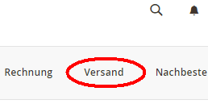
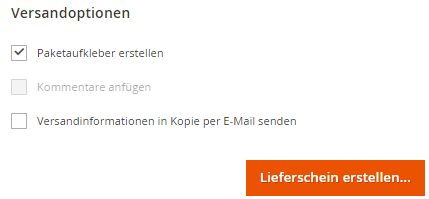
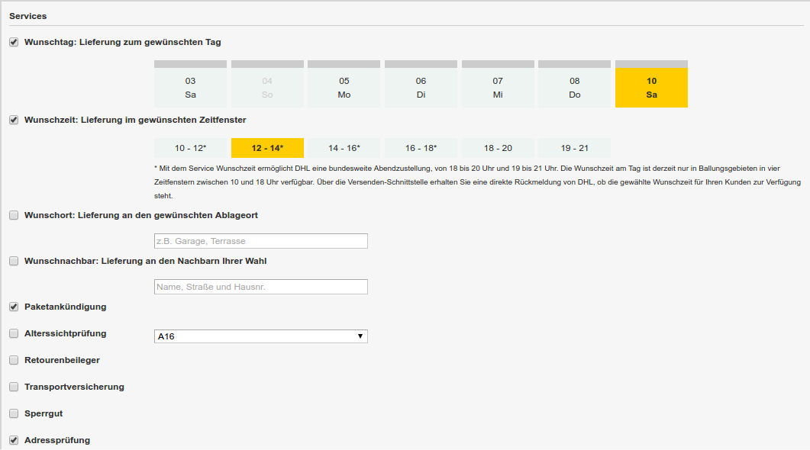
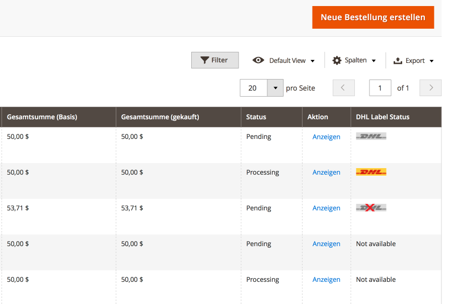
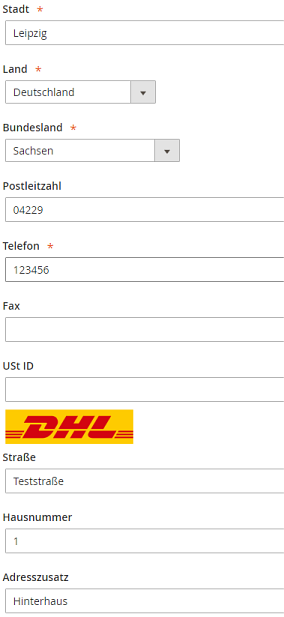

.. |date| date:: %d/%m/%Y
.. |year| date:: %Y
.. |mage| unicode:: Magento U+00AE
.. |mage2| replace:: |mage| 2

.. footer::
   .. class:: footertable

   +-------------------------+-------------------------+
   | Stand: |date|           | .. class:: rightalign   |
   |                         |                         |
   |                         | ###Page###/###Total###  |
   +-------------------------+-------------------------+

.. header::
   .. image:: images/dhl.jpg
      :width: 4.5cm
      :height: 1.2cm
      :align: right

.. sectnum::

========================
DHL Shipping für |mage2|
========================

Das Modul *DHL Shipping* für |mage2| ermöglicht es Händlern mit einem DHL-Konto
Sendungsaufträge anzulegen und DHL-Versandscheine (Paketaufkleber) abzurufen.

Das Modul unterstützt die folgenden Schnittstellen:

* DHL Paket Geschäftskundenversand API (Business Customer Shipping)
* DHL eCommerce Global Shipping API

Die tatsächlich nutzbaren Schnittstellen hängen vom Absenderstandort ab.

.. raw:: pdf

   PageBreak

.. contents:: Endbenutzer-Dokumentation

Voraussetzungen
===============

Die nachfolgenden Voraussetzungen müssen für den reibungslosen Betrieb des Moduls erfüllt sein.

|mage2|
-------

Folgende |mage2|-Versionen werden vom Modul unterstützt:

- Community Edition 2.2.4 oder höher

PHP
---

Für die Anbindung des DHL Webservice muss die PHP SOAP Erweiterung auf dem
Webserver installiert und aktiviert sein.

Folgende PHP-Versionen werden vom Modul unterstützt:

- PHP 5.6.5+
- PHP 7.0.6+

Weitere Informationen finden Sie auch in diesen Dateien im Modulpackage bzw. Repository:

* README.md
* composer.json

Im Zweifelsfall sind die Versionsangaben in der Datei *composer.json* maßgeblich.

Repository: https://github.com/netresearch/dhl-module-shipping-m2/

Hinweise zur Verwendung des Moduls
==================================

Versandursprung und Währung
---------------------------

Bei Nutzung der *DHL Geschäftskundenversand API (Business Customer Shipping)* ist der
Versand aus Deutschland und Österreich möglich. Die Absenderadresse des Shops muss in
einem dieser Länder liegen.

Wenn die *eCommerce Global Label API* genutzt wird, ist der Versand aus folgenden
Ländern möglich: Australien, Chile, China, Hongkong, Indien, Japan, Kanada,
Malaysia, Neuseeland, Singapur, Thailand, USA, Vietnam.

Beachten Sie auch die Informationen in Abschnitt `Internationale Sendungen`_.

Stellen Sie in jedem Fall sicher, dass die Absenderadressen in den drei im Abschnitt
Modulkonfiguration_ genannten Bereichen korrekt ist.

Als Basiswährung wird die für das jeweilige Absenderland offiziell gültige Standardwährung
angenommen, die in der |mage|-Konfiguration eingestellt sein muss. Es findet keine
automatische Konvertierung der Währungen statt.

.. raw:: pdf

   PageBreak

Installation und Konfiguration
==============================

Installation
------------

Installieren Sie das Modul gemäß der Anweisung in der Datei *README.md*, die Sie im
Modulpackage finden. Achten Sie darauf, alle Anweisungen exakt zu befolgen und keine
Schritte zu überspringen.

In der Datei *README.md* finden Sie zudem Informationen, welche Änderungen in der
Datenbank durch die Installation vorgenommen werden.

Die Datei *README.md* ist im Repository enthalten, welches im Abschnitt
`Voraussetzungen`_ verlinkt ist.

Modulkonfiguration
------------------

Für die Abwicklung von Versandaufträgen sind drei Konfigurationsbereiche relevant:

::

    Stores → Konfiguration → Allgemein → Allgemein → Store-Information
    Stores → Konfiguration → Verkäufe → Versandeinstellungen → Herkunft
    Stores → Konfiguration → Verkäufe → Versandarten → DHL Shipping

Stellen Sie sicher, dass die erforderlichen Felder aus den Bereichen
*Store-Information* und *Herkunft* vollständig ausgefüllt sind:

* Store-Information

  * Store-Name
  * Store-Kontakttelefon
* Herkunft

  * Land
  * Region/Bundesland
  * Postleitzahl
  * Stadt
  * Straße

Wenn Sie aus mehreren Ländern versenden, können Sie auf Webseiten- bzw. Store-Ebene
abweichende Absenderadressen eintragen.

.. admonition:: Hinweis

   Der Abschnitt *Versandarten → DHL* ist Kernbestandteil von |mage2| und bindet
   die Schnittstelle von DHL USA an. Diese Einstellungen beziehen sich nicht auf die
   *DHL Shipping*-Extension.

.. raw:: pdf

   PageBreak

Allgemeine Einstellungen
~~~~~~~~~~~~~~~~~~~~~~~~

Im Konfigurationsbereich *Allgemeine Einstellungen* wird angezeigt, welche der
zur Verfügung stehenden API-Anbindungen konfiguriert wird.

* DHL Business Customer Shipping (DE, AT), oder
* DHL eCommerce Global Label API

Dieses Feld ist bereits gemäß dem eingestellten Versandursprung vorbelegt und
ist nicht manuell anzupassen.

.. admonition:: Hinweis

   Die tatsächlich verwendete API-Anbindung hängt vom Versandursprung
   (Absenderadresse der Sendung) ab und wird zur Beauftragung von
   Paketaufklebern automatisch gewählt. Das Dropdown macht lediglich die
   passenden Konfigurationsfelder sichtbar.

Außerdem kann in diesem Abschnitt gewählt werden, ob der *Sandbox-Modus* zum Testen
der Integration verwendet oder die Extension produktiv betrieben werden soll.

Wenn die Protokollierung aktiviert ist, werden Webservice-Nachrichten in die |mage2|
Log-Dateien in ``var/log`` geschrieben. Es wird *keine gesonderte* Log-Datei für
die DHL-Extension erstellt.

Sie haben die Auswahl zwischen drei Protokollstufen:

- *Error*: Zeichnet Kommunikationsfehler zwischen Shop und DHL Webservice auf.
- *Warning*: Zeichnet Kommunikationsfehler sowie Fehler aufgrund falscher Sendungsdaten
  (z.B. Adressvalidierung, ungültige Service-Auswahl), auf.
- *Debug*: Zeichnet sämtliche Nachrichten einschl. Paketaufkleber-Rohdaten im Log auf.

.. admonition:: Hinweis

   Stellen Sie sicher, dass die Log-Dateien regelmäßig bereinigt bzw. rotiert werden. Die
   Einstellung *Debug* sollte nur zur Problembehebung aktiviert werden, da die Log-Dateien
   sonst mit der Zeit sehr groß werden.

Weitere Eingabefelder, die hier nicht beschrieben wurden, sind nicht relevant.

.. raw:: pdf

   PageBreak

Stammdaten
~~~~~~~~~~

In diesem Konfigurationsbereich werden Ihre Zugangsdaten für den DHL Webservice
hinterlegt. Die Zugangsdaten erhalten Sie direkt von DHL.

Für die Nutzung des *DHL Geschäftskundenversands (Business Customer Shipping)*
im Sandbox-Modus sind keine Stammdaten erforderlich.

Für die Nutzung des *DHL Geschäftskundenversands (Business Customer Shipping)*
im Produktivbetrieb tragen Sie folgende Daten ein:

* Benutzername (User)
* Passwort (Signature)
* EKP (DHL-Kundennummer, 10 stellig)
* Teilnahmenummern (Participation, jeweils zweistellig)

Zur Nutzung der *eCommerce Global Label API* tragen Sie stattdessen folgende Daten ein:

* Pickup Account Number (5-10 stellig)
* Customer Prefix (bis zu 5 Stellen)
* Distribution Center (6 stellig)
* Client ID
* Client Secret

Allgemeine Versandeinstellungen
~~~~~~~~~~~~~~~~~~~~~~~~~~~~~~~

In diesem Konfigurationsbereich werden Basis-Einstellungen vorgenommen, die
für die Erstellung von Versandaufträgen über den DHL Webservice erforderlich sind.

- *Versandarten für DHL Shipping*: Legen Sie fest, welche Versandarten für die
  Versandkostenberechnung im Checkout verwendet werden sollen. Nur die hier ausgewählten
  Versandarten werden bei der Lieferscheinerstellung über die DHL-Extension abgewickelt.
- *Standardprodukt*: Stellen Sie hier das DHL Produkt ein, das standardmäßig zur
  Erstellung von Versandaufträgen verwendet werden soll. Wenn keine Auswahl möglich ist,
  sind die Felder ausgegraut. Beachten Sie die Hinweise im Abschnitt Modulkonfiguration_
  zur Absenderadresse.

.. raw:: pdf

   PageBreak

DHL Geschäftskundenversand Einstellungen
~~~~~~~~~~~~~~~~~~~~~~~~~~~~~~~~~~~~~~~~

Die Einstellungen in diesem Bereich sind speziell bei Nutzung des
*DHL Geschäftskundenversands (Business Customer Shipping)* relevant.

- *Nachnahme-Zahlarten für DHL Shipping*: Legen Sie fest, bei welchen Zahlarten
  es sich um Nachnahme-Zahlarten handelt. Diese Information wird benötigt, um
  bei Bedarf den Nachnahmebetrag an den DHL Webservice zu übertragen und passende
  Nachnahme-Label zu erzeugen.

- Ebenso legen Sie fest, welche Bankdaten für
  Nachnahme-Versandaufträge an DHL übermittelt werden. Der vom Empfänger erhobene
  Nachnahmebetrag wird auf dieses Konto transferiert.

  Beachten Sie, dass die Bankverbindung ggf. auch in Ihrem DHL-Konto hinterlegt werden
  muss. I.d.R. kann dies über das DHL Geschäftskundenportal erledigt werden.

- Weitehin können Sie festlegen, welche Absenderdaten ergänzend
  zur allgemeinen |mage|-Konfiguration an DHL übermittelt werden sollen.

Dieser Abschnitt wird bei Nutzung der *eCommerce Global Label API* nicht angezeigt,
da hier kein Nachnahmeversand möglich ist.

Einstellungen für die Massenerstellung von Versandetiketten
~~~~~~~~~~~~~~~~~~~~~~~~~~~~~~~~~~~~~~~~~~~~~~~~~~~~~~~~~~~

In diesem Konfigurationsbereich legen Sie die Standardwerte für Sendungen fest, die
automatisch (per Cronjob) oder über die Massenaktion_ erstellt werden.

Je nach gewählter API (DHL Business Customer Shipping, eCommerce Global Label API, ...) erscheinen
hier unterschiedliche Eingabemöglichkeiten.

Beachten Sie zudem die Konfiguration von Zollinformationen über die Produkt-Attribute, siehe
Abschnitt `Internationale Sendungen`_.

Weiterhin können in diesem Konfigurationsbereich die Standardwerte für DHL Zusatzleistungen
(Services) eingestellt werden.

- *Nur leitkodierbare Versandaufträge erteilen*: Ist diese Einstellung aktiviert,
  wird DHL nur Sendungen akzeptieren, deren Adressen absolut korrekt sind. Ansonsten
  lehnt DHL die Sendung mit einer Fehlermeldung ab. Wenn diese Einstellung abgeschaltet
  ist, wird DHL versuchen, fehlerhafte Lieferadressen automatisch korrekt zuzuordnen,
  wofür ein Nachkodierungsentgelt erhoben wird. Wenn die Adresse überhaupt nicht
  zugeordnet werden kann, wird die Sendung dennoch abgelehnt.
- *Paketankündigung*: Der Kunde wird per E-Mail von DHL über den Status seiner
  Sendung informiert.
- *Alterssichtprüfung:* Wählen Sie, ob die Versandlabel das Vermerk zur Alterssichtprüfung
  tragen sollen, sowie welches Alter gelten soll. Auswahl:

  * *Nein*: Der Service wird nicht hinzugebucht.
  * *A16*: Mindestalter 16 Jahre.
  * *A18*: Mindestalter 18 Jahre.

- *Retourenbeileger*: Wählen Sie, ob zum Versandauftrag auch ein Retourenbeileger
  erstellt werden soll. Siehe auch `Erstellen eines Retouren-Beilegers`_.
- *Zusatzversicherung:* Wählen Sie, ob für den Versandauftrag eine Zusatzversicherung
  hinzugebucht werden soll.
- *Sperrgut:* Wählen Sie, ob der Service *Sperrgut* hinzugebucht werden soll.

.. raw:: pdf

   PageBreak

eCommerce Global API Versandeinstellungen
~~~~~~~~~~~~~~~~~~~~~~~~~~~~~~~~~~~~~~~~~

Hier können Einstellungen zur Labelgröße, Seitengröße und Seitenlayout vorgenommen werden.

Dieser Abschnitt erscheint nur bei Nutzung der *eCommerce Global Label API*.

Automatische Sendungserstellung
~~~~~~~~~~~~~~~~~~~~~~~~~~~~~~~

Im diesem Konfigurationsbereich legen Sie fest, ob automatisch Lieferscheine erzeugt
und Paketaufkleber abgerufen werden sollen.

Darüber hinaus können Sie bestimmen, welchen Bestell-Status eine Bestellung haben
muss, um während der automatischen Sendungserstellung berücksichtigt zu werden. Hierüber
können Sie steuern, welche Bestellungen von der automatischen Verarbeitung ausgeschlossen
werden sollen.

Außerdem legen Sie hier fest, ob eine E-Mail an den Käufer gesendet werden soll,
wenn der Lieferschein angelegt wurde. Hierbei handelt es sich um die
Versandbestätigung von |mage|, nicht um die Paketankündigung von DHL.

Zusätzliche Produkt-Attribute
~~~~~~~~~~~~~~~~~~~~~~~~~~~~~

Das Modul führt die neuen Produkt-Attribute **Produktbeschreibung** (DHL Export Description)
und **Zolltarifnummer** (Tariff number) ein, welche für internationale Sendungen nutzbar
sind.

Diese Attribute können verwendet werden, um Zollinformationen fest im System zu hinterlegen,
so dass diese nicht bei jeder Sendung von Hand eingetragen werden müssen.

Zu beachten ist die maximale Länge von:
 * 50 Zeichen für die Produktbeschreibung
 * 10 Zeichen für die Zolltarifnummer

Beachten Sie auch die Hinweise im Abschnitt `Internationale Sendungen`_.

.. raw:: pdf

   PageBreak

Ablaufbeschreibung und Features
===============================

Annahme einer Bestellung
------------------------

Im Folgenden wird beschrieben, wie sich die DHL-Extension in den Bestellprozess integriert.

Bestellung über Checkout
~~~~~~~~~~~~~~~~~~~~~~~~

In der Modulkonfiguration_ wurden Versandarten für die Abwicklung der Versandaufträge
und die Erstellung der Paketaufkleber eingestellt. Wählt der Kunde im Checkout-Schritt
*Versandart* eine dieser DHL-Versandarten, kann die Lieferung im Nachgang über DHL
abgewickelt werden.

Im Checkout-Schritt *Zahlungsinformation* werden Nachnahme-Zahlungen automatisch
deaktiviert, falls der Nachnahme-Service für die gewählte Lieferadresse nicht zur
Verfügung steht (siehe *Nachnahme-Zahlarten für DHL Shipping*).

Bestellung über Admin Panel
~~~~~~~~~~~~~~~~~~~~~~~~~~~

Nachnahme-Zahlarten werden ebenso wie im Checkout deaktiviert, falls der
Nachnahme-Service für die gewählte Lieferadresse nicht zur Verfügung steht.

DHL Lieferadressen (Packstationen, Postfilialen)
~~~~~~~~~~~~~~~~~~~~~~~~~~~~~~~~~~~~~~~~~~~~~~~~

Das Modul bietet eine eingeschränkte Unterstüzung von DHL Lieferadressen im Checkout:

* Das Format *Packstation 123* im Feld *Straße* wird erkannt.
* Das Format *Postfiliale 123* im Feld *Straße* wird erkannt.
* Ein numerischer Wert im Feld *Firma* wird als Postnummer erkannt.

.. admonition:: Hinweis

   Für die Übertragung an DHL ist die korrekte Schreibweise der o.g. Angaben entscheidend.

   Siehe auch `Versand an Filialen <https://www.dhl.de/de/privatkunden/pakete-empfangen/an-einem-abholort-empfangen/filiale-empfang.html>`_
   und `Versand an Packstationen <https://www.dhl.de/de/privatkunden/pakete-empfangen/an-einem-abholort-empfangen/packstation-empfang.html>`_.

.. raw:: pdf

   PageBreak

Erstellen eines Versandauftrags
-------------------------------

Im Folgenden Abschnitt wird beschrieben, wie zu einer Bestellung ein Versandauftrag
erstellt und ein Paketaufkleber abgerufen wird.

Nationale Sendungen
~~~~~~~~~~~~~~~~~~~

Öffnen Sie im Admin Panel eine Bestellung, deren Versandart mit dem DHL-Versand
verknüpft ist (siehe `Modulkonfiguration`_, Abschnitt *Versandarten für DHL Shipping*).

Betätigen Sie dann den Button *Versand* im oberen Bereich der Seite.

Es öffnet sich die Seite *Neuer Versand für Bestellung*.

Wählen Sie die Checkbox
*Paketaufkleber erstellen* an und betätigen Sie den Button *Lieferschein erstellen…*.

Es öffnet sich nun ein Popup zur Definition der im Paket enthaltenen Artikel. Das im
Abschnitt `Allgemeine Versandeinstellungen`_ eingestellte Standardprodukt ist hier
vorausgewählt.

Betätigen Sie den Button *Artikel hinzufügen*, markieren Sie *alle* Produkte und
bestätigen Sie Ihre Auswahl durch Klick auf *Gewählte Artikel zum Paket hinzufügen*.

Die Angabe der Paketmaße ist optional. Achten Sie auf das korrekte Paketgewicht.

Der Button *OK* im Popup ist nun aktiviert. Bei Betätigung wird ein Versandauftrag
an DHL übermittelt und im Erfolgsfall der resultierende Paketaufkleber abgerufen.

Im Fehlerfall wird eine Meldung am oberen Rand des Popups eingeblendet. Scrollen Sie
wenn nötig im Popup nach oben, falls die Fehlermeldung nicht sofort zu sehen ist.

Die Bestellung kann entsprechend korrigiert werden, siehe auch `Fehlerbehandlung`_.

.. raw:: pdf

   PageBreak

Internationale Sendungen
~~~~~~~~~~~~~~~~~~~~~~~~

Für internationale Sendungen sind unter bestimmten Umständen Zollinformationen notwendig.

Dabei gilt:

* Bei Nutzung des *DHL Geschäftskundenversands (Business Customer Shipping)* müssen für Ziele
  außerhalb der EU mindestens die Zolltarifnummern sowie der Inhaltstyp der Sendung angegeben
  werden.
* Bei Nutzung der *eCommerce Global Label API* müssen für Ziele außerhalb des Ursprungslandes
  mindestens die Zolltarifnummern, die Handelsklauseln und der Inhaltstyp der Sendung angegeben
  werden.

Die **Produktbeschreibung** (DHL Export Description) und **Zolltarifnummer** (Tariff number) werden
aus den gleichnamigen **Produkt-Attributen** übernommen, siehe auch
`Zusätzliche Produkt-Attribute`_. Wenn die Produktbeschreibung nicht gepflegt, ist wird stattdessen
der Produktname hierfür benutzt.

Standardwerte (z.B. Handelsklauseln) können in der Konfiguration des Moduls gesetzt werden.

Alternativ können die Angaben auch von Hand in das Popup zur Sendungserstellung eingegeben werden,
z.B. für Sonderfälle, die von den Standardwerten abweichen.

Gehen Sie ansonsten wie im Abschnitt `Nationale Sendungen`_ beschrieben vor.

.. admonition:: Besonderheit bei konfigurierbaren Produkten

   Bei **konfigurierbaren** Produkten (Configurable products) müssen die o.g. Attribute direkt am
   konfigurierbaren Produkt selbst gepflegt werden, **nicht** an den verknüpften einfachen Produkten
   (Simple products)!

.. raw:: pdf

   PageBreak

Service-Auswahl
~~~~~~~~~~~~~~~

Die für die aktuelle Lieferadresse möglichen Zusatzleistungen werden im Popup eingeblendet.

Die Vorauswahl der Services hängt von den Standardwerten in der allgemeinen
`Modulkonfiguration`_ ab.

.. admonition:: Hinweis

   Dieser Screenshot ist nur ein Beispiel. Es stehen evtl. noch nicht alle hier gezeigten
   Services zur Verfügung.

.. raw:: pdf

   PageBreak

Massenaktion
~~~~~~~~~~~~

Lieferscheine und Paketaufkleber können über die Massenaktion
*Paketaufkleber abrufen* in der Bestellübersicht erzeugt werden:

* Verkäufe → Bestellungen → Massenaktion *Paketaufkleber abrufen*

Dies ermöglicht es, Paketaufkleber ohne zusätzliche Eingaben zu erstellen

* für alle in der Bestellung enthaltenen Artikel
* mit den im Checkout gewählten Zusatzleistungen
* mit den im Bereich *Einstellungen zur Erstellung von Massensendungen* der Modulkonfiguration_
  gewählten Zusatzleistungen.

Bei internationalen Sendungen werden wenn nötig die Zollinformationen aus den Produkt-Attributen
sowie aus den Standardwerten in der Konfiguration verwendet (siehe `Internationale Sendungen`_).

.. admonition:: Hinweis

   Im Dropdown sind zwei ähnliche Einträge zu finden: *Paketaufkleber abrufen* und *Paketaufkleber drucken*.
   Achten Sie darauf, den korrekten Eintrag zu nutzen!

   Die Funktion *Paketaufkleber drucken* ermöglicht lediglich den erneuten Ausdruck **bereits gespeicherter** DHL-Label.

.. raw:: pdf

   PageBreak

Drucken eines Paketaufklebers
-----------------------------

Erfolgreich abgerufene Paketaufkleber können an verschiedenen Stellen im Admin Panel
eingesehen werden:

* Verkäufe → Bestellungen → Massenaktion *Paketaufkleber drucken*
* Verkäufe → Lieferscheine → Massenaktion *Paketaufkleber drucken*
* Detail-Ansicht eines Lieferscheins → Button *Paketaufkleber drucken*

Hierdurch wird keine Übertragung an DHL durchgeführt, sondern lediglich die bereits
vorliegenden Label nochmal ausgegeben. Um die Übertragung auszuführen, nutzen Sie
stattdessen die `Massenaktion`_.

.. admonition:: Hinweis

   Die exakte Bezeichnung der Menüpunkte *Bestellungen* bzw. *Lieferscheine* kann je
   nach installiertem Language Pack leicht abweichen (z.B. *Aufträge* oder *Lieferungen*).
   Das ist aber für die weitere Nutzung unerheblich.

.. raw:: pdf

   PageBreak

Erstellen eines Retouren-Beilegers
----------------------------------

Bei Versand innerhalb Deutschlands, innerhalb Österreichs oder von Österreich
nach Deutschland ist es möglich, gemeinsam mit dem Paketaufkleber einen
Retouren-Beileger zu beauftragen.

Nutzen Sie dafür beim Erstellen des Labels im Popup das Auswahlfeld *Retouren-Beileger*.

Stellen Sie sicher, dass die `Teilnahmenummern`__ für Retouren korrekt konfiguriert sind:

- Retoure DHL Paket (DE → DE)
- Retoure DHL Paket Austria (AT → AT)
- Retoure DHL Paket Connect (AT → DE)

__ `Stammdaten`_

.. raw:: pdf

   PageBreak

Stornieren eines Versandauftrags
--------------------------------

Solange ein Versandauftrag nicht manifestiert ist, kann dieser bei DHL storniert werden.

Sie können den Link *Löschen* in der Box *Versand- und Trackinginformationen* neben der
Sendungsnummer anklicken.

Bei Nutzung des *DHL Geschäftskundenversands (Business Customer Shipping)* wird hierdurch
auch der Auftrag bei DHL storniert.

.. image:: images/de/shipping_and_tracking.png
   :scale: 75 %

.. admonition:: Hinweis zur eCommerce Global Label API

   Bei Nutzung der *eCommerce Global Label API* wird über den oben beschriebenen Weg der
   Auftrag bei DHL *nicht* storniert! Es wird lediglich die Trackingnummer aus |mage| entfernt.

   Zur Stornierung eines *eCommerce Global Label API* Versandauftrags nutzen Sie bitte den
   Ihnen bekannten Zugang über die DHL Website (z.B. das Geschäftskundenportal).

   Wenn lediglich die Trackingnummer aus |mage| entfernt wird, ohne den Auftrag bei
   DHL zu stornieren, wird DHL diesen in Rechnung stellen.

.. raw:: pdf

   PageBreak

Automatische Sendungserstellung
-------------------------------

Der manuelle Prozess zur Erstellung von Versandaufträgen ist insbesondere für
Händler mit hohem Versandvolumen sehr zeitaufwendig und unkomfortabel. Um den
Abruf von Paketaufklebern zu erleichtern, können Sie das Erstellen von
Lieferscheinen und Versandaufträgen automatisieren.

Aktivieren Sie dazu in der Modulkonfiguration_ die automatische Sendungserstellung
und legen Sie fest, welche Zusatzleistungen für alle automatisch erzeugten Versandaufträge
hinzugebucht werden sollen.

.. admonition:: Hinweis

   Die automatische Sendungserstellung erfordert funktionierende |mage| Cron Jobs.

Im Abstand von 15 Minuten werden alle versandbereiten Bestellungen (gemäß den
getroffenen Einstellungen) gesammelt und an DHL übermittelt.

Bei erfolgreicher Übertragung werden die DHL-Label in |mage| gespeichert und die
Lieferscheine erstellt.

Im Fehlerfall sehen Sie die entsprechende Meldung in den Bestellkommentaren.

.. raw:: pdf

   PageBreak

Übersicht über offene und erstellte Sendungen
---------------------------------------------

Unter *Verkäufe → Bestellungen* finden Sie eine Spalte *DHL Label Status*.
Dort wird der aktuelle Zustand Ihrer DHL-Sendungen abgebildet.

Die Symbole haben folgende Bedeutung:

- *DHL-Logo farbig*: Die DHL-Sendung wurde erfolgreich erstellt
- *DHL-Logo ausgegraut*: Die DHL-Sendung wurde noch nicht oder nur teilweise erstellt
- *DHL-Logo durchgestrichen*: Beim Erstellen der DHL-Sendung ist zuletzt ein Fehler aufgetreten

Bei Sendungen, die nicht mit DHL Shipping verarbeitet werden können, wird kein Logo angezeigt.

Über die Funktion *Filter* in der Bestellübersicht lassen sich Bestellungen nach den verschiedenen Labelstati filtern.

.. raw:: pdf

   PageBreak

Fehlerbehandlung
----------------

Während der Übertragung von Versandaufträgen an den DHL Webservice kann es zu
Fehlern bei der Erstellung eines Paketaufklebers kommen. Die Ursache dafür ist
in der Regel eine ungültige Liefer- bzw. Absenderadresse oder eine Fehlkonfiguration.

Bei der manuellen Erstellung von Versandaufträgen werden die vom Webservice
zurückgemeldete Fehlermeldung direkt im Popup angezeigt. Scrollen Sie ggf. im Popup
nach oben, um die Meldung zu sehen.

Wenn die Protokollierung in der Modulkonfiguration_ einschaltet ist, können Sie
fehlerhafte Versandaufträge auch in den Log-Dateien detailliert nachvollziehen.

Fehlerhafte Versandaufträge können wie folgt manuell korrigiert werden:

* Im Popup zur Definition der im Paket enthaltenen Artikel können ungültige
  Angaben korrigiert werden.
* In der Detail-Ansicht der Bestellung oder des Lieferscheins kann die
  Lieferadresse korrigiert werden. Betätigen Sie dazu den Link *Bearbeiten*
  in der Box *Versandadresse*.

  .. image:: images/de/edit_address_link.png
     :scale: 75 %

  Im nun angezeigten Formular können Sie im oberen Bereich die Standard-Felder
  der Lieferadresse bearbeiten und im unteren Bereich die zusätzlichen
  DHL-spezifischen Felder:

  * Straße (ohne Hausnummer)
  * Hausnummer (einzeln)
  * Adresszusatz

Speichern Sie anschließend die Adresse. Wurde die Fehlerursache behoben, so kann
das manuelle `Erstellen eines Versandauftrags`_ erneut durchgeführt werden.

Wurde ein Versandauftrag über den Webservice erfolgreich erstellt und sollen
dennoch nachträgliche Korrekturen vorgenommen werden, so stornieren Sie den
Versandauftrag wie im Abschnitt `Stornieren eines Versandauftrags`_ beschrieben
und betätigen Sie anschließend den Button *Paketaufkleber erstellen…* in
derselben Box *Versand- und Trackinginformationen*. Es gilt dasselbe Vorgehen
wie im Abschnitt `Erstellen eines Versandauftrags`_ beschrieben.

.. raw:: pdf

   PageBreak

Modul deinstallieren
====================

Befolgen Sie die Anleitung aus der Datei *README.md* im Modulpackage, um das
Modul zu deinstallieren.

Die Datei *README.md* ist im Abschnitt `Voraussetzungen`_ verlinkt.

Technischer Support
===================

Wenn Sie Fragen haben oder auf Probleme stoßen, werfen Sie bitte zuerst einen Blick in das
Support-Portal (FAQ): http://dhl.support.netresearch.de/

Sollte sich das Problem damit nicht beheben lassen, können Sie das Supportteam über das o.g.
Portal oder per Mail unter dhl.support@netresearch.de kontaktieren.
