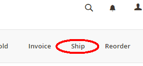
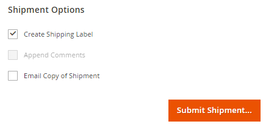
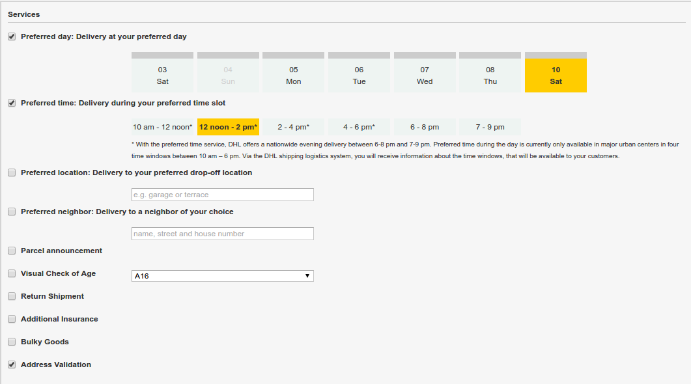
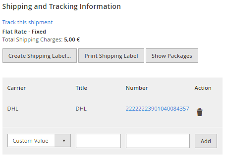
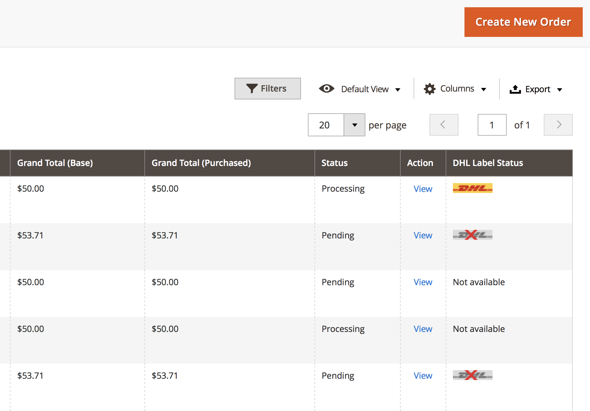

.. |date| date:: %d/%m/%Y
.. |year| date:: %Y
.. |mage| unicode:: Magento U+00AE
.. |mage2| replace:: |mage| 2

.. footer::
   .. class:: footertable

   +-------------------------+-------------------------+
   | Stand: |date|           | .. class:: rightalign   |
   |                         |                         |
   |                         | ###Page###/###Total###  |
   +-------------------------+-------------------------+

.. header::
   .. image:: images/dhl.jpg
      :width: 4.5cm
      :height: 1.2cm
      :align: right

.. sectnum::

========================
DHL Shipping for |mage2|
========================

The module *DHL Shipping* for |mage2| enables merchants with a DHL account to
create shipments and retrieve shipping labels.

The module supports the following webservices:

* DHL Paket Business Customer Shipping (Geschäftskundenversand) API
* DHL eCommerce Global Shipping API

Which of these webservices can actually be used depends on the shipping origin.

.. raw:: pdf

   PageBreak

.. contents:: End user documentation

.. raw:: pdf

   PageBreak

Requirements
============

The following requirements must be met for a smooth operation of the module.

|mage2|
-------

The following |mage2| versions are supported:

- Community Edition 2.2.4 or higher

PHP
---

To connect to the API (webservice), the PHP SOAP extension must be installed
and enabled on the web server.

These PHP versions are supported:

- PHP 5.6.5+
- PHP 7.0.6+

Further information can also be found in these files inside the module package / repository:

* README.md
* composer.json

If in doubt: the version information in the file *composer.json* supersedes any
other information.

Repository: https://github.com/netresearch/dhl-module-shipping-m2/

Hints for using the module
==========================

Shipping origin and currency
----------------------------

When using the *DHL Business Customer Shipping (Geschäftskundenversand) API* shipments
must originate from Germany or Austria. The sender address of the shop must be located
in one of those countries.

When using the *eCommerce Global Label API* shipments can be sent from the following
countries: Australia, Canada, Chile, China, Hongkong, India, Japan, Malaysia,
New Zealand, Singapore, Thailand, USA, Vietnam.

Please also note the information in section `International shipments`_.

In any case, make sure that the sender address information in the configuration sections
mentioned in `Module configuration`_ is correct.

The base currency is assumed to be the official currency of the sender country which is
set in the |mage| configuration. There is no automated conversion between currencies.

.. raw:: pdf

   PageBreak

Installation and configuration
==============================

Installation
------------

Install the module according to the instructions from the file *README.md* which you can
find in the module package. It is very important to follow all steps exactly as shown there.
Do not skip any steps.

The file *README.md* also describes the database changes which are made during installation.

The *README.md* can be found in the repository which is linked in the section `Requirements`_.

Module configuration
--------------------

There are three configuration sections which are relevant for creating shipments:

::

    Stores → Configuration → General → General → Store-Information
    Stores → Configuration → Sales → Shipping Settings → Origin
    Stores → Configuration → Sales → Shipping Methods → DHL Shipping

Make sure that the following required fields in the sections *Store Information*
and *Origin* are filled in completely:

* Store Information

  * Store Name
  * Store Contact Telephone
* Origin

  * Country
  * Region / State
  * ZIP / Postal Code
  * City
  * Street Address

If you are shipping from multiple countries, you can configure different sender
addresses on *Website* or *Store* level.

.. admonition:: Note

   The section *Shipping Methods → DHL* is a core part of |mage2| which connects
   to the webservice of DHL USA only. These settings are not relevant for the *DHL Shipping* module.

.. raw:: pdf

   PageBreak

General Settings
~~~~~~~~~~~~~~~~

The first dropdown in the configuration section *General Settings* shows which
API connection is about to be configured.

* DHL Business Customer Shipping (DE, AT), or
* DHL eCommerce Global Label API

This field is pre-selected according to the current shipping origin and does not
need to be changed manually.

.. admonition:: Note

   The actual API connection to be used depends on the origin address of the shipment
   and is selected automatically during transmission to DHL. The dropdown only makes the
   configuration fields visible.

You can choose if you want to run the module in *Sandbox Mode* to test the integration,
or using the production mode.

If the logging is enabled in the DHL module, the webservice messages will be recorded
in the log files in ``var/log``. There will be *no separate* log file for the DHL module.

You can choose between three log levels:

- *Error:* Records communication errors between the shop and the DHL webservice.
- *Warning:* Records communication errors and also errors due to invalid shipment
  data (e.g. address validation failed, invalid services selected).
- *Debug:* Record all messages, including downloaded label raw data in the log.

.. admonition:: Note

   Make sure to clear or rotate the log files regularly. The log level *Debug* should
   only be set while resolving problems, because it will result in very large log files
   over time.

Configuration options that are not described here are not relevant.

.. raw:: pdf

   PageBreak

Account Data
~~~~~~~~~~~~

This configuration section holds your access credentials for the DHL webservice
which are required for production mode. You will get this information directly from
DHL.

When using *DHL Business Customer Shipping (Geschäftskundenversand)* in sandbox
mode, no additional input is necessary.

When using *DHL Business Customer Shipping (Geschäftskundenversand)* in production,
enter the following data:

* Username (German: Benutzername)
* Signature (German: Passwort)
* EKP (DHL account number, 10 digits)
* Participation numbers (German: Teilnahmenummern, two digits per field)

When using the *eCommerce Global Label API*, enter the following data:

* Pickup Account Number (5 to 10 digits)
* Customer Prefix (up to 5 digits)
* Distribution Center (6 digits)
* Client ID
* Client Secret

General Shipping Settings
~~~~~~~~~~~~~~~~~~~~~~~~~

In this section, the basic configuration for creating shipments via
the DHL webservice is made.

* *Shipping Methods for DHL Shipping*: Select which shipping methods should be
  used for calculating shipping costs in the checkout. Only shipping methods that are
  selected here will be handled by the DHL extension when creating shipments.
* *Default product*: Set the DHL product which should be used by default for creating
  shipments. If no selection is possible, the fields will be disabled. Please note the
  information in section `Module configuration`_ regarding the sender (origin) address.

.. raw:: pdf

   PageBreak

DHL Business Customer Shipping Settings
~~~~~~~~~~~~~~~~~~~~~~~~~~~~~~~~~~~~~~~

This section contains settings which are relevant if the
*DHL Business Customer Shipping (Geschäftskundenversand)* is used.

- *Cash On Delivery payment methods for DHL Shipping*: Select which payment methods
  should be treated as Cash On Delivery (COD) payment methods. This is necessary
  to transmit the additional charge for Cash On Delivery to the DHL webservice
  and create Cash On Delivery labels.

- configure the bank account to be used for Cash On
  Delivery (COD) shipments with DHL. The Cash On Delivery amount from the customer
  will be transferred to this bank account.

  Please note that you might also have to store the bank data in your DHL account.
  Usually, this can be done through the DHL Business Customer Portal (Geschäftskundenportal).

- configure which sender (shipper) information should be
  transmitted to DHL in addition to the general |mage| configuration settings.

When using the *eCommerce Global Label API*, the service Cash On Delivery is
currently not available.

Bulk Shipping Label Creation Settings
~~~~~~~~~~~~~~~~~~~~~~~~~~~~~~~~~~~~~

In this section, the default values are configured for shipments that are created
automatically (Cronjob) or via the `Mass action`_.

Depending on the selected API (DHL Business Customer Shipping, eCommerce Global Label API, ...),
different values can be configured.

Please also note the configuration of customs information in the product attributes, see
section `International shipments`_.

Furthermore, in this configuration section, the default values for additional DHL services can be defined.

- *Print only if codeable*: If this is enabled, only shipments with perfectly
  valid addresses will be accepted by DHL. Otherwise, DHL will reject the shipment
  and issue an error message. If this option is disabled, DHL will attempt to
  correct an invalid address automatically, which results in an additional charge
  (Nachkodierungsentgelt). If the address cannot be corrected, DHL will still
  reject the shipment.
- *Parcel announcement*: The customer gets notified via email about the status
  of the shipment.
- *Visual Check of Age:* Select if the service for age verification should be
  booked, and what the minimum age is. Options:

  * *No*: The service will not be booked.
  * *A16:* Minimum age 16 years.
  * *A18:* Minimum age 18 years.

- *Return Shipment:* Select if a return label should be created together with the
  shipping label. See also `Printing a return slip`_.
- *Additional Insurance:* Select if an additional insurance should be booked for
  the shipment.
- *Bulky Goods:* Select if the service for bulky goods (bulk freight) should be booked.

.. raw:: pdf

   PageBreak

eCommerce Global API Shipping Settings
~~~~~~~~~~~~~~~~~~~~~~~~~~~~~~~~~~~~~~

In this section you can configure the label size, page size, and layout.

Automatic Shipping Label Creation
~~~~~~~~~~~~~~~~~~~~~~~~~~~~~~~~~

The section *Automatic Shipment Creation* lets you choose if shipments should be
created and package labels retrieved automatically.

You can also configure which order status an order must have to be processed
automatically. You can use this to exclude specific orders from being processed
automatically.

Also, you can choose whether or not an email will be be sent to the customer when the
shipment has been created. This refers to the |mage| shipment confirmation email,
not the parcel announcement from DHL.

Additional Product-Attributes
~~~~~~~~~~~~~~~~~~~~~~~~~~~~~

The module introduces the new product attributes **DHL Export Description** and
**Tariff number** which can be used for international shipments.

These atrributes allow storing the customs information in the system, so the data
doesn't have to be entered manually for every shipment.

**Please note the maximum length of:**

 * 50 characters for DHL Export Description
 * 10 character for Tariff Number

Also note the section `International shipments`_.

Workflow and features
=====================

Creating an order
-----------------

The following section describes how the DHL extension integrates itself into the order
process.

Checkout
~~~~~~~~

In the `Module configuration`_ the shipping methods have been selected for which DHL
shipments and labels should be created. If the customer now selects one of those
shipping methods in the checkout, the shipment can later be processed by DHL.

In the checkout step *Payment information* the Cash On Delivery payment methods
will be disabled if Cash On Delivery is not available for the selected delivery
address (see *Cash On Delivery payment methods for DHL Shipping*).

Admin Order
~~~~~~~~~~~

When creating orders via the Admin Panel, the Cash On Delivery payment methods
will be disabled if Cash On Delivery is not available for the delivery address
(same behaviour as in the checkout).

DHL Delivery Addresses (Packing Stations, Post Offices)
~~~~~~~~~~~~~~~~~~~~~~~~~~~~~~~~~~~~~~~~~~~~~~~~~~~~~~~
The module offers limited support for DHL delivery addresses in the checkout:

* The format *Packstation 123* in the field *Street* will be recognized.
* The format *Postfiliale 123* in the field *Street* will be recognized.
* A numerical value in the field *Company* will be recognized as Post Number.

.. admonition:: Note

   For successful transmission to DHL, the above information must be entered in
   the correct format.

   See also `Shipping to post offices <https://www.dhl.de/en/privatkunden/pakete-empfangen/an-einem-abholort-empfangen/filiale-empfang.html>`_
   and `Shipping to Packstations <https://www.dhl.de/en/privatkunden/pakete-empfangen/an-einem-abholort-empfangen/packstation-empfang.html>`_.

.. raw:: pdf

   PageBreak

Creating a shipment
-------------------

The following section explains how to create a shipment for an order and how
to retrieve the shipping label.

National shipments
~~~~~~~~~~~~~~~~~~

In the Admin Panel, select an order with a shipping method linked to DHL (see
`Module configuration`_, section *Shipping Methods for DHL Shipping*).

Then click the button *Ship* on the top of the page.

You will get to the page *New shipment for order*.

Activate the checkbox *Create shipping label* and click the button *Submit Shipment...*.

Now a popup window for selecting the shipping items in the package will be opened. The
default product from the section `General Shipping Settings`_ will be pre-selected.

Click the button *Add products*, select *all* products, and confirm by clicking
*Add selected product(s) to package*.

The package dimensions are optional. Make sure the weight is correct.

The button *OK* in the popup window is now enabled. When clicking it, the shipment
will be transmitted to DHL and (if the transmission was successful) a shipping
label will be retrieved.

If there was an error, the message from the DHL webservice will be displayed at the top
of the popup. You might have to scroll up inside the popup to see the error message.

The incorrect data can now be corrected, see also `Troubleshooting`_.

.. raw:: pdf

   PageBreak

International shipments
~~~~~~~~~~~~~~~~~~~~~~~

For international shipments, information for the customs declaration might be needed.

In particular:

*  When using *DHL Business Customer Shipping (Geschäftskundenversand)* for destinations
   outside of the EU, at least the customs tariff number and the export content type of
   the shipment are needed.
*  When using the *eCommerce Global Label API* for destinations outside of the origin
   country, at least the Terms Of Trade (Incoterms), the Customs Tariff Number (HS Code), and
   the product export description are needed.

The **export description** and the **tariff number** are taken from the respective **product
attributes**, see also `Additional Product-Attributes`_. If the export description is not set,
the product name will be used instead.

The default values (e.g. Terms Of Trade) can be set in the module configuration.

Alternatively, you can enter the information by hand in the popup when creating the shipment,
e.g. for special cases with different, non-default information.

Everything else is the same as described in the section `National shipments`_.

.. admonition:: About configurable products

   For **configurable** products, the aforementioned attributes must be set directly in the configurable
   product, **not** in the associated simple products.

.. raw:: pdf

   PageBreak

Service selection
~~~~~~~~~~~~~~~~~

The available services for the current delivery address are shown in the packaging popup window.

The preselection of the services depends on the default values from the general
`Module configuration`_.

.. admonition:: Note

   This screenshot is just an example. Not all services shown here might be available yet.

.. raw:: pdf

   PageBreak

Mass action
~~~~~~~~~~~

Shipments and labels can also be created using the mass action *Create Shipping Labels* in
the order grid:

* Sales → Orders → Mass action *Create Shipping Labels*

This allows the creation of shipping labels with no further user input

* for all items contained in the order
* with the services selected during checkout
* with the services selected in the *Automatic Shipment Creation* `Module configuration`_.

For international shipments, the customs information will be taken from the product attributes
and the default values in the configuration (see `International shipments`_), if necessary.

.. admonition:: Note

   The dropdown contains two very similar entries: *Print shipping labels* and *Create shipping labels*.
   Make sure to use the correct entry!

   The function *Print shipping labels* only allows printing **existing** shipping labels.

.. raw:: pdf

   PageBreak

Printing a shipping label
-------------------------

The successfully retrieved shipping labels can be opened in several locations
of the Admin Panel:

* Sales → Orders → Mass action *Print shipping labels*
* Sales → Shipments → Mass action *Print shipping labels*
* Detail page of a shipment → Button *Print shipping label*

This does not trigger the transmission to DHL, but only opens the labels again that
already exist. To transmit shipments to DHL, please use the `Mass action`_.

.. admonition:: Note

   If you are using a German locale, the exact names of the German menu entries
   *Bestellungen* or *Lieferscheine* can differ slightly, depending on the installed
   Language Pack (e.g. *Aufträge* or *Lieferungen*). However, this is not important
   for the usage.

.. raw:: pdf

   PageBreak

Printing a return slip
----------------------

When shipping within Germany, within Austria, or from Austria to Germany,
it is possible to create a return slip together with the shipping label.

Use the option *Retoure slip* when requesting a label in the packaging popup.

To book this service, make sure the `participation numbers`__ for returns are properly configured:

- Retoure DHL Paket (DE → DE)
- Retoure DHL Paket Austria (AT → AT)
- Retoure DHL Paket Connect (AT → DE)

__ `Account Data`_

.. raw:: pdf

   PageBreak

Canceling a shipment
--------------------

As long as a shipment has not been manifested, it can be canceled at DHL.

You can click the link *Delete* in the box *Shipping and tracking information* next
to the tracking number.

When using *DHL Business Customer Shipping*, this will also
cancel the shipment at DHL.

.. admonition:: Note for eCommerce Global Label API

   If you are using the *eCommerce Global Label API* the above workflow will *not*
   cancel the shipment at DHL! It only deletes the tracking number in |mage|.

   To cancel an *eCommerce Global Label API* shipment, please use the usual way via
   the DHL website (e.g. the DHL Business Customer Portal).

   If you only delete the tracking number in |mage| without cancelling the shipment
   at DHL, you will be charged by DHL for the shipping cost.

.. raw:: pdf

   PageBreak

Automatic shipment creation
---------------------------

The process for creating shipments manually can be too time-consuming or
cumbersome for merchants with a high shipment volume. To make this easier,
you can automate the process of creating shipments and transmitting them to
DHL.

Enable the automatic shipment creation in the `Module configuration`_ and
select which services should be booked by default.

.. admonition:: Note

   The automatic shipment creation requires working |mage| cron jobs.

Every 15 minutes all orders which are ready for shipping (based on the configuration)
will be collected and transmitted to DHL.

If the transmission was successful, the label will be stored in |mage| and the
|mage| shipments will be created.

Error messages will be shown in the order comments.

.. raw:: pdf

   PageBreak

Shipment Overview
-----------------

In the order grid at *Sales → Orders* you will find a column *DHL Label Status*.
It displays the current status of your DHL shipments.

The symbols have the following meaning:

- *colored DHL logo*: The DHL shipment was successfully created
- *grey DHL logo*: The DHL shipment was not yet created, or the order was only partially shipped
- *crossed-out DHL logo*: There was an error during the last attempt to create a DHL shipment

Shipments that cannot be processed by DHL Shipping will not display a logo in the DHL Label Status column.

You can filter orders by DHL label status using the *Filters* function above the order grid.

.. raw:: pdf

   PageBreak

Troubleshooting
---------------

During the transmission of shipments to DHL, errors can occur. These are often
caused by an invalid address or an invalid combination of additional services.

When creating shipments manually, the error message will be directly visible in
the popup. You might have to scroll up inside the popup to see the message.

If the logging is enabled in the `Module Configuration`_, you can also check the
shipments in the log files.

Erroneous shipment requests can be corrected as follows:

- In the popup window for selecting the package articles, you can correct invalid
  information.
- On the detail page of the order or shipment, you can edit the receiver address
  and correct any errors. Use the link *Edit* in the box *Shipping address*.

  .. image:: images/en/edit_address_link.png
     :scale: 75 %

  On this page, you can edit the address fields in the upper part, and the special
  fields for DHL shipping in the lower part:

  * Street name (without house number)
  * House number (separately)
  * Address addition

.. image:: images/en/edit_address_form.png
   :scale: 75 %

Afterwards, save the address. If the error has been corrected, you can retry
`Creating a shipment`_.

If a shipment has already been transmitted successfully via the webservice, but
you want to make changes afterwards, please cancel the shipment first as described
in the section `Canceling a shipment`_. Then click *Create shipping label...*
inside the same box *Shipping and tracking information*. From here on, the
process is the same as described in `Creating a shipment`_.

.. raw:: pdf

   PageBreak

Uninstalling the module
=======================

To uninstall the module, follow these steps described in the file *README.md* from
the module package.

The *README.md* is linked in the section `Requirements`_.

Technical support
=================

In case of questions or problems, please have a look at the Support Portal
(FAQ) first: http://dhl.support.netresearch.de/

If the problem cannot be resolved, you can contact the support team via the
Support Portal or by sending an email to dhl.support@netresearch.de
